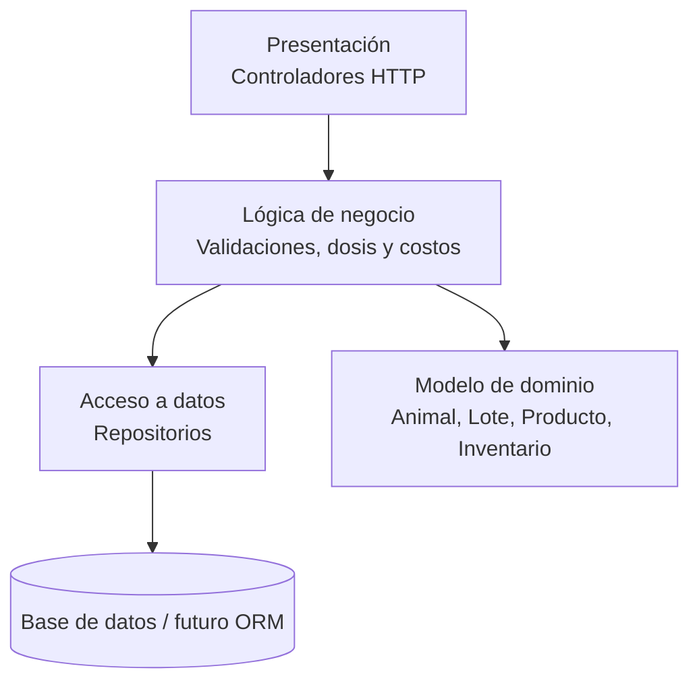

# SisGanado Backend

Backend independiente para el sistema de control sanitario y costos de ganado.

## Objetivo
Dejar el backend separado del repositorio principal, con una arquitectura preparada para:
- PostgreSQL como base relacional para transacciones y dominio principal.
- MongoDB como base documental para auditoría y registros flexibles.
- Spring Boot 3 + Java 21 como capa de servicio y API.

## Stack
- Java 21
- Spring Boot 3.3.x
- Gradle
- PostgreSQL 16
- MongoDB 7
- Docker Compose

## Estructura del backend
- Capa de dominio: entidades del negocio.
- Capa de datos: repositorios y acceso a persistencia.
- Capa de negocio: lógica y validaciones.
- Capa de presentación: controladores REST.

## Requisitos
- Java 21
- Docker Desktop
- Git

## Ejecutar infraestructura
```bash
docker compose up -d
```

Este comando levanta PostgreSQL y MongoDB juntos. Compose incluye healthchecks
para confirmar que ambos servicios están disponibles:

```bash
docker compose ps
```

## Ejecutar la aplicación
```bash
./gradlew bootRun
```

Para usar las dos bases de datos Docker y cargar datos de ejemplo en ambas,
ejecute la aplicación con el perfil `local` después de levantar Compose:

```bash
./gradlew bootRun --args="--spring.profiles.active=local"
```

El `DataSeeder` crea un lote y dos animales en PostgreSQL, y un evento en la
colección MongoDB `bitacora_eventos`. El seeder no duplica registros existentes.

## Health check
```bash
curl http://localhost:8080/actuator/health
```

## Regla de negocio clave
La cantidad de unidades a consumir se calcula con redondeo hacia arriba para garantizar que nunca falte producto en la jornada sanitaria.

## Modelo de persistencia
- PostgreSQL: lotes, animales, inventario, compras, jornadas, costos y relación transaccional.
- MongoDB: bitácoras, historial, observaciones y documentos no estructurados.

La descripción del modelo, sus decisiones de diseño y la justificación del
subdominio documental están en [docs/modelo-datos.md](docs/modelo-datos.md).

## Entidades principales
- Animal
- Lote
- ProductoVeterinario
- Inventario
- JornadaSanitaria
- AplicacionSanitaria
- PlanSanitario
- Proveedor
- Compra
- Usuario

## Estado actual
Este proyecto queda separado del repositorio principal y listo para seguir con la capa de persistencia, servicios y endpoints del entregable.

**Validaciones:**
- Lote activo y con animales.
- Plan sanitario válido.
- Productos con eficacia documentada ≥ 95%.
- Fecha de presupuesto debe ser ≤ 7 días antes de ejecución (validación: relevancia temporal).
- Precios de alternativas no mayores a 30% por encima del actual (validación: sanidad económica).

**Salida (Reporte de Presupuesto):**
```json
{
  "idPresupuesto": "PRE-2024-001",
  "lote": "Lote A (50 animales)",
  "plan": "Desparasitación Q6",
  "dosis_total_ml": 200,
  "fecha_sugerida": "2024-09-15",
  "opcion_actual": {
    "producto": "Paramax Plus (Proveedor X)",
    "precio_unitario": 15000,
    "cantidad_unidades": 20,
    "costo_producto": 300000,
    "costos_adicionales": 80000,
    "costo_total": 380000,
    "costo_por_animal": 7600
  },
  "alternativas_recomendadas": [
    {
      "posicion": 1,
      "producto": "Parasitol Forte (Proveedor Y)",
      "precio_unitario": 12500,
      "eficacia": "98%",
      "cantidad_unidades": 20,
      "costo_producto": 250000,
      "costo_total": 330000,
      "ahorro_total": 50000,
      "ahorro_porcentaje": "13.2%",
      "plazo_entrega": "2 días",
      "recomendacion": "✓ Mejor relación costo-eficacia"
    },
    {
      "posicion": 2,
      "producto": "Antihelmix Vet (Proveedor Z)",
      "precio_unitario": 11000,
      "eficacia": "96%",
      "cantidad_unidades": 20,
      "costo_producto": 220000,
      "costo_total": 300000,
      "ahorro_total": 80000,
      "ahorro_porcentaje": "21.1%",
      "plazo_entrega": "5 días",
      "recomendacion": "⚠️ Máximo ahorro, pero plazo más largo"
    }
  ],
  "ahorro_maximo_potencial": 80000,
  "asistente_sugerencia": "Negociar con Proveedor X una reducción de 10% en Paramax Plus (podrían competir con Parasitol Forte). Esto preservaría la relación comercial actual ahorrando ₡38,000."
}
```

---

## 5 · Alcance

### Dentro del alcance (Lo que SÍ construiremos)

✅ Registro y consulta de animales y lotes.  
✅ Catálogo de productos veterinarios con proveedores.  
✅ Control de inventario: existencias, vencimientos, alertas de bajo stock.  
✅ Programación y ejecución de jornadas sanitarias.  
✅ Cálculo automático de dosis según peso y reglas sanitarias.  
✅ **Presupuesto estimado ANTES de ejecutar campaña** (nueva funcionalidad).  
✅ **Asistente inteligente con alternativas de productos y precios del mercado** (nueva funcionalidad).  
✅ Cálculo de costos totales y promedio por animal por jornada.  
✅ Comparativa de opciones económicas con recomendaciones de ahorro.  
✅ Consulta de historial de aplicaciones por animal/lote.  
✅ Control de acceso por rol (admin, ganadero, vet, contador).  
✅ API REST con validaciones de negocio.  
✅ Pruebas unitarias e integración.  
✅ Base de datos relacional (JPA/Hibernate en Lab 3).  
✅ Documentos flexible para bitácora/auditoría (MongoDB en Lab 2).  
✅ Transaccionalidad en procesos críticos (Lab 4).  
✅ Datos de mercado y alternativas de productos (fuente simulada o integración básica).  

### Fuera del alcance (Lo que NO construiremos)

❌ App móvil (solo web).  
❌ Facturación electrónica ante Hacienda.  
❌ Integración con sistemas de pago o banca.  
❌ Gestión de ventas de ganado (solo crianza y sanitario).  
❌ Reportes impresos PDF avanzados (solo JSON/HTML básico).  
❌ Sincronización con laboratorios veterinarios externos.  
❌ Predicción avanzada con modelos externos.
❌ Geolocalización GPS de animales.  
❌ Notificaciones por SMS/email automáticas.  
❌ Sistema de usuarios y autenticación OAuth/LDAP (solo login local).  
❌ Integración con APIs de proveedores reales (fuente de precios simulada).  

**Nota:** El "asistente inteligente" en este contexto es lógica heurística basada en reglas (eficacia ≥ 95%, plazo ≤ 3 días y precios históricos).

---

## Arquitectura: Cómo se organiza

```
src/main/java/cr/ac/una/eif509/demo/
├── presentation/   → Controladores HTTP de animales, inventario, jornadas y costos.
├── business/       → Servicios con validaciones, cálculos y reglas sanitarias.
├── data/           → Repositorios para animales, productos, inventario y compras.
├── domain/         → Entidades base del sistema.
└── config/         → Configuración de Spring (se llena más adelante).
```

**Regla de oro de las dependencias:** presentación → negocio → datos. Nunca al revés.
Cada capa solo conoce a la que tiene debajo. Las entidades de `domain` se usan
como modelo común entre capas.

## Cómo correrlo

```bash
# 1. Compilar y correr las pruebas
./gradlew build

# 2. Levantar la aplicación
./gradlew bootRun

# 3. Probar el resumen sanitario del ganado (en otra terminal, con la app corriendo)
curl "http://localhost:8080/api/ganado/control?animales=10"
# Respuesta esperada: mensaje, cantidad de animales y costo base por animal

# 4. Probar el cálculo de costo de una jornada sanitaria
curl "http://localhost:8080/api/jornadas/costo?animales=10&pesoPromedioKg=380&dosisMlPorKg=0.8&contenidoMlPorUnidad=10&precioProducto=12500&manoObra=25000&transporte=10000&veterinario=35000&otros=5000"
# Respuesta esperada: dosis total, costo de producto, costos adicionales y promedio por animal

# 5. Probar el health de Actuator
curl http://localhost:8080/actuator/health
# Respuesta esperada: {"status":"UP", ...}
```

## Módulos iniciales

- Registro de animales y lotes.
- Catálogo de productos veterinarios.
- Inventario con lotes, vencimientos y existencias.
- Jornadas sanitarias con aplicaciones, costos y promedios.
- Compras y proveedores.
- Alertas de bajo inventario y próximos vencimientos.

## Diagrama de arquitectura



La capa de presentación solo expone endpoints. La capa de negocio concentra
las reglas sanitarias, el cálculo de dosis, el costo total y el costo promedio
por animal. La capa de datos simula el acceso a precios e inventario y luego
podrá conectarse a una base de datos real.

## Checklist de entrega

- Propuesta de dominio documentada en `docs/propuesta-dominio.md`.
- Esqueleto Spring Boot 3 + Gradle por capas.
- `README` con instrucciones de ejecución y alcance funcional.
- `.gitignore` para Gradle, IDE y temporales.
- CI en GitHub Actions para compilar en cada push.
- ADR en `docs/adr/` con la decisión tecnológica.

## Entidades de negocio

El esqueleto incluye entidades base para:

- Animal
- Lote
- Producto veterinario
- Inventario
- Plan sanitario
- Aplicación sanitaria
- Jornada sanitaria
- Proveedor
- Compra
- Usuario

## Procesos cubiertos por el esqueleto

1. Programación y aplicación sanitaria.
2. Cálculo del costo de una jornada sanitaria.
3. Control de inventario veterinario.

## Resultado esperado

La base deja listo el sistema para luego conectar base de datos, formularios,
validaciones avanzadas, alertas y reportes por animal, lote o período.
