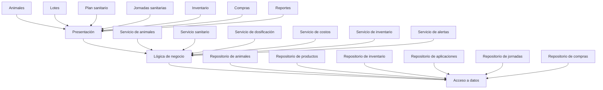

# Propuesta de Dominio

## Sistema elegido

**Sistema Web de Control Sanitario y Costos para Ganado**.

El sistema permitirá administrar la información sanitaria del ganado de una
finca. Cada animal tendrá un expediente con sus datos de identificación,
vacunas, desparasitaciones, tratamientos y próximas aplicaciones.

También permitirá registrar los productos veterinarios disponibles, controlar
su inventario y calcular automáticamente el costo de una vacunación o
desparasitación según dosis, peso, precio del producto, cantidad de animales y
costos adicionales.

## Entidades de negocio

El dominio incluye estas entidades:

1. Animal.
2. Lote.
3. Producto veterinario.
4. Inventario.
5. Plan sanitario.
6. Aplicación sanitaria.
7. Jornada sanitaria.
8. Proveedor.
9. Compra.
10. Usuario.

Con estas entidades se supera el mínimo requerido de seis entidades
relacionadas.

## Relaciones principales

- Un lote contiene muchos animales.
- Un animal puede tener muchas aplicaciones sanitarias.
- Un plan sanitario contiene varios productos y fechas programadas.
- Una jornada sanitaria incluye muchas aplicaciones.
- Cada aplicación sanitaria utiliza un producto veterinario.
- Un producto puede tener varias existencias, diferenciadas por lote y
  vencimiento.
- Un proveedor puede estar asociado con muchas compras.
- Una compra agrega productos al inventario.
- Un usuario registra jornadas, compras y aplicaciones sanitarias.

## Proceso 1: Programación y aplicación sanitaria

Este proceso administra el ciclo completo de una vacuna o desparasitación:

1. El usuario selecciona un animal o lote.
2. El sistema consulta el plan sanitario y el historial de aplicaciones.
3. Se muestran los tratamientos pendientes o próximos a vencer.
4. El sistema valida edad, peso y condición del animal.
5. Se calcula la dosis requerida.
6. Se verifica que exista producto suficiente y vigente.
7. Se registra la aplicación.
8. Se descuenta del inventario la cantidad utilizada.
9. Se calcula la próxima fecha de aplicación.
10. Se actualiza el expediente sanitario del animal.

### Reglas y validaciones

- No se puede aplicar un producto vencido.
- Debe existir inventario suficiente.
- No debe repetirse una vacuna antes del intervalo mínimo permitido.
- La dosis debe estar dentro del rango permitido para el peso del animal.
- El animal debe estar activo y pertenecer a un lote registrado.
- La fecha de aplicación no puede ser posterior a la fecha actual.
- El usuario debe registrar quién realizó la aplicación.
- Si el producto exige refuerzo, se debe generar automáticamente la próxima
  aplicación.
- El sistema debe advertir cuando existe un período de retiro para carne o
  leche.

## Proceso 2: Cálculo del costo de una jornada sanitaria

Este proceso calcula cuánto cuesta vacunar o desparasitar uno o varios
animales:

1. El usuario selecciona los animales que participarán.
2. El sistema determina la dosis de cada animal.
3. Se calcula la cantidad total de producto requerida.
4. Se consulta el costo unitario del inventario utilizado.
5. Se agregan otros costos, como mano de obra, transporte o veterinario.
6. Se registra el costo total de la jornada.
7. Se calcula el costo promedio por animal.

### Reglas y validaciones

- La jornada debe incluir al menos un animal.
- Los costos no pueden ser negativos.
- La cantidad utilizada no puede superar el inventario disponible.
- El costo del producto debe tomarse del lote de inventario realmente
  consumido.
- Si se utilizan varios productos, todos deben incluirse en el cálculo.
- No se puede cerrar una jornada mientras tenga aplicaciones incompletas.
- Los costos adicionales deben indicar concepto y monto.
- Una jornada cerrada no puede modificarse sin autorización administrativa.

## Proceso adicional: Control de inventario veterinario

1. Se registra una compra de productos.
2. Se almacena número de lote, fecha de vencimiento, cantidad y costo.
3. Cada aplicación descuenta la dosis utilizada.
4. El sistema genera alertas por bajo inventario o vencimiento próximo.
5. Para utilizar productos, se priorizan los lotes con vencimiento más cercano.

### Validaciones principales

- No aceptar cantidades de compra iguales o menores que cero.
- No aceptar fechas de vencimiento anteriores a la fecha de compra.
- No permitir salidas superiores a las existencias.
- No permitir eliminar productos que tengan movimientos registrados.
- Mantener un historial de entradas, salidas y ajustes.

## Arquitectura en capas

## Propuesta formal del proyecto

**Nombre:** Sistema Web de Control Sanitario y Costos para Ganado.

**Objetivo general:** Desarrollar un esqueleto de una aplicación web
empresarial organizada en capas que permita administrar vacunas y
desparasitaciones del ganado, controlar el inventario de productos veterinarios
y calcular los costos asociados con cada jornada sanitaria.

**Alcance inicial:** El sistema incluirá la gestión de animales, lotes,
productos veterinarios, inventario, planes sanitarios, aplicaciones y
jornadas. Aplicará reglas de dosificación, intervalos entre tratamientos,
vencimiento de productos y disponibilidad de inventario. Además, calculará el
costo total y promedio por animal de cada actividad sanitaria.