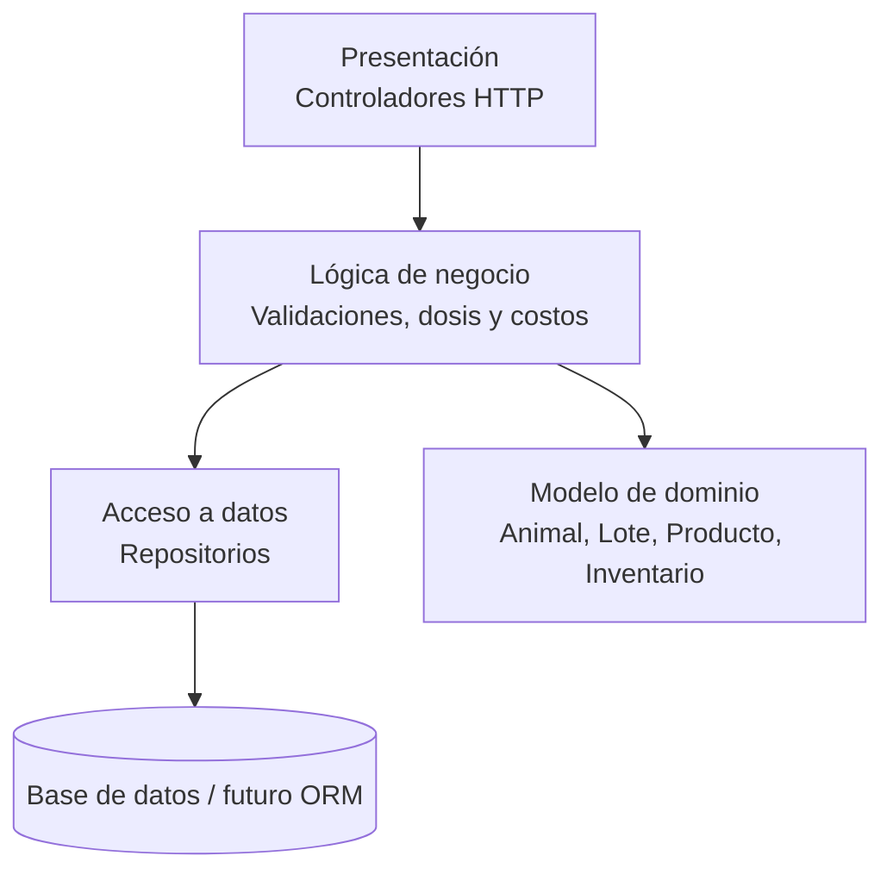

# Sistema Web de Control Sanitario y Costos para Ganado

Proyecto **Spring Boot 3 + Java 21 + Gradle** organizado por capas, como base
para administrar la información sanitaria del ganado, controlar inventario de
productos veterinarios y calcular costos de vacunación y desparasitación.

> ⚠️ **Este repo es un esqueleto de referencia del proyecto.**

## Cómo se organiza (arquitectura por capas)

```
src/main/java/cr/ac/una/eif509/demo/
├── presentation/   → Controladores HTTP de animales, inventario, jornadas y costos.
├── business/       → Servicios con validaciones, cálculos y reglas sanitarias.
├── data/           → Repositorios para animales, productos, inventario y compras.
├── domain/         → Entidades base del sistema.
└── config/         → Configuración de Spring (se llena más adelante).
```

**Regla de oro de las dependencias:** presentación → negocio → datos. Nunca al revés.
Cada capa solo conoce a la que tiene debajo. Las entidades de `domain` se usan
como modelo común entre capas.

## Cómo correrlo

```bash
# 1. Compilar y correr las pruebas
./gradlew build

# 2. Levantar la aplicación
./gradlew bootRun

# 3. Probar el resumen sanitario del ganado (en otra terminal, con la app corriendo)
curl "http://localhost:8080/api/ganado/control?animales=10"
# Respuesta esperada: mensaje, cantidad de animales y costo base por animal

# 4. Probar el cálculo de costo de una jornada sanitaria
curl "http://localhost:8080/api/jornadas/costo?animales=10&pesoPromedioKg=380&dosisMlPorKg=0.8&contenidoMlPorUnidad=10&precioProducto=12500&manoObra=25000&transporte=10000&veterinario=35000&otros=5000"
# Respuesta esperada: dosis total, costo de producto, costos adicionales y promedio por animal

# 5. Probar el health de Actuator
curl http://localhost:8080/actuator/health
# Respuesta esperada: {"status":"UP", ...}
```

## Módulos iniciales

- Registro de animales y lotes.
- Catálogo de productos veterinarios.
- Inventario con lotes, vencimientos y existencias.
- Jornadas sanitarias con aplicaciones, costos y promedios.
- Compras y proveedores.
- Alertas de bajo inventario y próximos vencimientos.

## Diagrama de arquitectura



La capa de presentación solo expone endpoints. La capa de negocio concentra
las reglas sanitarias, el cálculo de dosis, el costo total y el costo promedio
por animal. La capa de datos simula el acceso a precios e inventario y luego
podrá conectarse a una base de datos real.

## Checklist de entrega

- Propuesta de dominio documentada en `docs/propuesta-dominio.md`.
- Esqueleto Spring Boot 3 + Gradle por capas.
- `README` con instrucciones de ejecución y alcance funcional.
- `.gitignore` para Gradle, IDE y temporales.
- CI en GitHub Actions para compilar en cada push.
- ADR en `docs/adr/` con la decisión tecnológica.

## Entidades de negocio

El esqueleto incluye entidades base para:

- Animal
- Lote
- Producto veterinario
- Inventario
- Plan sanitario
- Aplicación sanitaria
- Jornada sanitaria
- Proveedor
- Compra
- Usuario

## Procesos cubiertos por el esqueleto

1. Programación y aplicación sanitaria.
2. Cálculo del costo de una jornada sanitaria.
3. Control de inventario veterinario.

## Resultado esperado

La base deja listo el sistema para luego conectar base de datos, formularios,
validaciones avanzadas, alertas y reportes por animal, lote o período.
